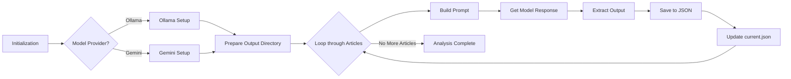

# Deep Truth

Welcome to **Deep Truth** – an AI-powered fact-finder and article enhancer! 🎉  
DeepTruth is a super cool Node.js project that processes articles using state-of-the-art generative AI models like [Ollama](https://ollama.com) to extract quotes and related text and integrate them into a cohesive article.

---

## Table of Contents

* [Table of Contents](#table-of-contents)
* [What Is DeepTruth?](#what-is-deeptruth)
* [Features](#features)
* [Installation](#installation)
* [Usage](#usage)
* [Output Files](#output-files)
* [How It Works](#how-it-works)
* [Generating the Dataset](#generating-the-dataset)
* [Standing with Palestine 🇵🇸](#standing-with-palestine-)

---

## What Is DeepTruth?

DeepTruth is designed to:

* **Analyze** a collection of articles based on a user-defined query.
* **Extract** exact phrases and facts from text.
* **Integrate** these quotes into a growing, coherent article.
* **Support** multiple AI model providers with easy configuration.

Think of it as your personal truth detective—digging deep into articles and assembling the ultimate narrative! 🕵️‍♂️✨

---

## Features

* **Multi-Model Support:** Choose between Ollama and Google Generative AI.
* **Streaming Responses:** Processes AI responses in real-time.
* **Customizable Output:** Saves outputs in JSON format to your specified directory.
* **Easy-to-Use API:** Designed as a class to integrate seamlessly into your projects.
* **Retry Mechanism:** Includes retry logic for robust handling of network issues with AI providers.

---

## Installation

```bash
git clone https://github.com/mlibre/deeptruth.git
cd deeptruth
npm install
```

If you plan to use Gemini, make sure to add your API key:

```bash
export GOOGLE_API_KEY=your_google_api_key_here

# or

nano .env
GOOGLE_API_KEY=your_google_api_key_here
```

---

## Usage

Here's a quick example to get you started:

```js
const DeepTruth = require('deep-truth');

void async function main ()
{
 const deepTruth = new DeepTruth({
 userQuery: "What are the israel lies about palestine?",
 modelProvider: "ollama", // or "gemini"
 ollamaHost: "http://127.0.0.1:11434",
 ollamaOptions: {
  model: "llama3.2",
  stream: true,
  options: { temperature: 0, num_predict: 5500 }
 },
 geminiOptions: {
  model: "gemini-2.0-flash",
  apiKey: process.env.GOOGLE_API_KEY
 },
 outputDir: "./outputs"
 });

 // Assume you have an array of article objects ready to process
 const articles = [
 {
  text: "Article text goes here...",
  metadata: {
   articleTitle: "Title text goes here. ex: Israel is not a country ...",
   url: "https://example.com/revolution"
  }
 },
 // more articles...
 ];
 await deepTruth.processArticles(articles);
}();
```

Run your script with:

```bash
node your-script.js
```

---

## Output Files

DeepTruth generates JSON files in the specified `outputDir` (defaults to `./outputs`). Two types of output files are created:

* **Individual Article Files:** For each processed article, a file named `{articleNumber}.json` (e.g., `1.json`, `2.json`) is created. These files contain the following data:

```json:./outputs/1.json
{
  "userQuery": "What are the israel lies about palestine?",
  "response": [
    {
      "paragraph": "Israel often claims that Palestinians left their homes voluntarily in 1948.  However, extensive historical evidence, including eyewitness accounts and documented Israeli military actions, points to forced expulsion and displacement of Palestinians during the Nakba."
    },
    {
      "paragraph": "Another common narrative is that the land was 'empty' before the creation of Israel. This ignores the long-standing Palestinian presence and agricultural communities that thrived in the region for centuries."
    }
  ],
  "processedArticle": {
    "text": "Original article text would go here...",
    "title": "Debunking Myths about Palestine",
    "url": "https://example.com/article1"
  },
  "prompt": "The full prompt sent to the AI model would be here...",
  "processedUrls": [
    "https://example.com/article1"
  ]
}
```

* **Current State File:** A file named `current.json` is updated after each article is processed. This file contains the same data as the individual article files but always reflects the latest processed article. This is useful for monitoring progress.  For example, after processing two articles, `current.json` might look like this:

```json:./outputs/current.json
{
  "1": [
     {
       "paragraph": "Israel often claims that Palestinians left their homes voluntarily in 1948. However, extensive historical evidence, including eyewitness accounts and documented Israeli military actions, points to forced expulsion and displacement of Palestinians during the Nakba."
     },
     {
       "paragraph": "Another common narrative is that the land was 'empty' before the creation of Israel. This ignores the long-standing Palestinian presence and agricultural communities that thrived in the region for centuries."
     }
   ],
  "2": [
    {
      "paragraph": "The claim that Palestine was a 'land without a people for a people without a land' is a historical fabrication.  Palestine had a vibrant and diverse population long before the Zionist movement."
    },
    {
      "paragraph": "The lie of 'self-defense' is used to justify Israeli crimes and maintain the brutal occupation of Palestine."
    }
  ]
}

```

## How It Works



## Generating the Dataset

This project uses the [Clean-Web-Scraper](https://github.com/mlibre/Clean-Web-Scraper) library to generate the dataset.  You can find the scraper example in `utils/data-gatherer.js`.  
To generate the dataset, run:

```bash
node utils/data-gatherer.js
```

This will create the dataset files in the `dataset` directory.  
You can then use these files with the `DeepTruth` class as described in the [Usage](#usage) section.

---

## Standing with Palestine 🇵🇸

This project supports Palestinian rights and stands in solidarity with Palestine. We believe in the importance of documenting and preserving Palestinian narratives, history, and struggles for justice and liberation.

Free Palestine 🇵🇸
